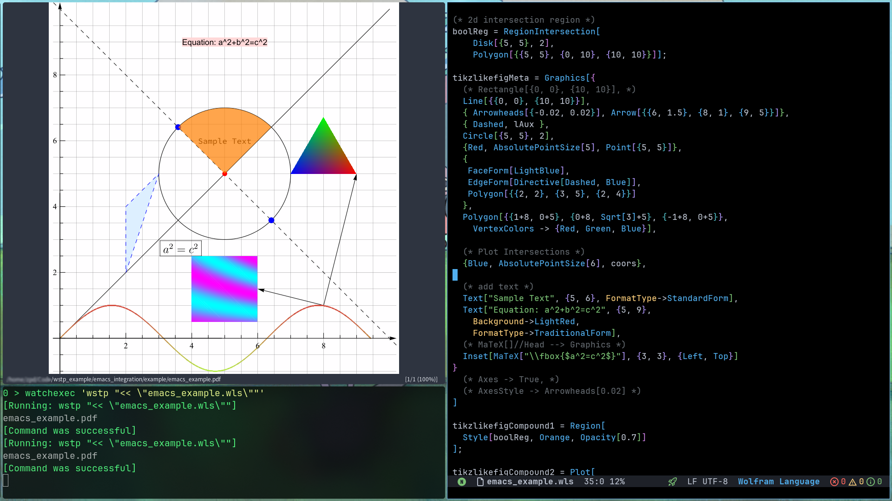

## emacs configure
Syntax highlight and LSP config for emacs:

``` elisp
;; wolframscript path
(setenv "PATH" (concat "/usr/local/Wolfram/Wolfram/14.3/SystemFiles/Kernel/Binaries/Linux-x86-64" path-separator (getenv "PATH")))

(defun file-name-only ()
  "Get the current buffer file name without directory."
  (file-name-nondirectory (buffer-name)))

(use-package wolfram-mode
  :custom (wolfram-indent-offset 4)
  :hook
    ;; NOTE: compile code(relies on 'PATH' variable in 'early-init.el')
    (wolfram-mode  .  (lambda()(progn
        (setq-local tab-width 4
                    indent-tabs-mode nil)
        (setq-local lsp-enable-text-document-color nil)
        ;; (setq-local compile-command (concat "wolframscript" " -script " (file-name-only)))
        (setq-local compile-command (concat "wstp " "'<< \"" (file-name-only) "\"'"))
        ;; Show diagnostics on-the-fly
        (setq-local lsp-diagnostics-provider :flycheck)
      )
    ))
)
```

> Do NOT copy this code to your config without modification !

For more details, please refer to the `lisp` directory.


## launch wolfram kernel
Use command:

``` shell
wstp_daemon start
```


## watch files change
I use [watchexec](https://github.com/watchexec/watchexec), run command below:

``` shell
cd example
watchexec 'wstp "<< \"tikz_use_wolfram_2dGraphics.wls\""'
```


## Working Example


